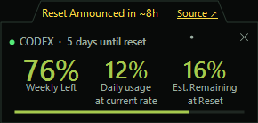
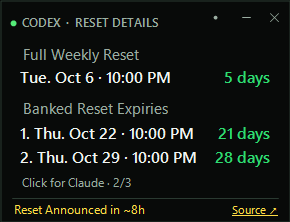
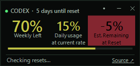
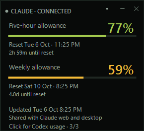

# CodexBar — MajorCommand Edition

**A tiny Windows desktop widget for tracking Codex and Claude usage limits and reset times.**

An independently maintained fork of [jspann21's CodexBar](https://github.com/jspann21/codex-bar), with usage forecasts, three compact faces, reset announcements and visibility diagnostics. The original author created CodexBar; MajorCommand maintains this edition. This project is not affiliated with OpenAI or Anthropic, or endorsed by the original author.

**[Download the public beta](https://github.com/majorcommand/codex-bar/releases/tag/v1.2.0-beta.5)** · [All releases](https://github.com/majorcommand/codex-bar/releases) · [Report an issue](https://github.com/majorcommand/codex-bar/issues) · [Changelog](CHANGELOG.md)

The current MajorCommand release is **1.2.0-beta.5**. The design has been tested locally, but long-running visibility behavior is still being monitored. Please include the version and circumstances when reporting a problem.

The Codex pages automatically reuse your existing signed-in Codex session. The third page tracks Claude's five-hour and weekly allowance using your existing Claude Code login. The Codex main face shows remaining weekly capacity, average daily usage, and an estimated forecast. Click to switch to the reset-details face, with larger dates and times for the next weekly reset and every available banked reset expiry. It stays out of the way as a compact, draggable widget and continues updating from the Windows notification area.

**Usage overview — Crown layout, illustrative data**



**Reset details — Bottom layout, illustrative data**



These examples demonstrate both announcement layouts. Choose **Reset announcements → Crown/Bottom** from the menu; the saved choice applies to both Codex faces.


**Forecast warning — illustrative data**



The warning highlights only **Est. Remaining at Reset** when it displays zero or below. A negative value shows the projected shortfall, while actual weekly capacity stays separate.

**Collapsed progress strip — illustrative data**


Click **.** to collapse toward the progress bar. Click the strip to restore the widget, or drag it to reposition.

**Claude allowance — illustrative data**



The third face uses your Claude Code login. Account usage refreshes every five minutes; right-click and choose **Refresh Claude** for a manual check.

## Highlights

- Reuses your existing Codex authentication and Claude Code login
- Shows **weekly capacity remaining**, not usage consumed
- Displays the next reset in your local date and time
- Lists the exact expiration date and time of every available banked rate-limit reset
- Changes from green to amber to red as capacity runs low
- Highlights Est. Remaining at Reset in muted red with black text when average usage predicts running out before reset
- Cycles through Codex usage, Codex reset details and Claude with a click; details grow vertically rather than shrinking the text
- Keeps the main usage body at 290 × 114 logical pixels, with three prominent percentages, labels below them, reset countdown in the title and the progress bar below
- Shows Claude's five-hour and weekly allowance remaining with reset times and five-minute account reads
- Adds a 24-pixel reset-announcement strip on both Codex faces, with a saved Crown or Bottom layout and yellow text for announced or possible resets
- Restores the compact face's position after viewing larger details or hover content, including at screen edges
- Optionally expands the usage face vertically on hover for larger values and fuller labels, then returns to its compact size when the pointer leaves
- Refreshes automatically at a configurable interval
- Minimizes to the Windows notification area
- Offers a saved Show in taskbar option while the widget remains visible; the notification-area icon stays available
- Supports adjustable transparency and always-on-top mode
- Can launch automatically when Windows starts
- Checks this edition's GitHub releases for updates and offers a download-page link
- Can notify you by email when weekly capacity resets to fully available
- Actively fetches current limits through Codex's supported local app-server interface
- Roughly 300 KB as a framework-dependent Windows executable

## Using the widget

### Claude page

The face cycle is **Codex usage → Codex reset details → Claude → Codex usage**. Click the body, press Space/Enter, or use **Switch face**. Claude shows five-hour and weekly percentages remaining, local reset dates, countdowns and the last successful update time. These allowances are shared with Claude web and desktop. Codex reset announcements stay on the two Codex faces; the tray number remains Codex weekly usage. Collapsing Claude shows its weekly allowance.

Sign in through Claude Code using `claude auth login --claudeai`, then choose **Refresh Claude**. Signing into the Claude desktop interface alone does not necessarily provide a valid Claude Code login. If Claude Code is bundled with Desktop and is not on PATH, run `auth login --claudeai` with that installation's `claude.exe`. Claude owns sign-in and credential writes. The widget asks native Claude Code to renew within five minutes of access-token expiry, after expiry, or after an authentication rejection, then rereads the credential and retries the usage request once. You only need another sign-in when Claude can no longer renew the saved login.

Following [steipete/CodexBar's Claude integration](https://github.com/steipete/CodexBar/blob/main/docs/claude.md), the widget reads `claudeAiOauth` from `%USERPROFILE%\.claude\.credentials.json` (or `CLAUDE_CONFIG_DIR\.credentials.json` when set). It sends the existing profile-scoped access token only to the fixed HTTPS endpoint `https://api.anthropic.com/api/oauth/usage`, with redirects disabled. This account endpoint is not a stable public API and may change. CodexBar does not write credentials directly, copy them into its preferences, or persist Claude usage. Renewal runs through Claude Code, which can update its own credential file. No status-line setup is required, and Claude Code need not remain open.

Account reads run every five minutes, independently of Codex refreshes. **Refresh Claude** and **Refresh now** can request an earlier read, with a minimum one-minute interval; server rate-limit delays also apply to manual refreshes. Concurrent reads are prevented. Usage requests have a fifteen-second deadline and bounded responses. Native renewal has a twenty-five-second deadline, closes standard input, disables MCP startup and Remote Control for that process, and discards bounded output. It runs a fixed `/status` probe in an isolated local folder without saving a conversation. Failed recovery is retried at the normal interval; manual refreshes cannot launch repeated probes within one minute. Desktop CLI discovery follows installed version directories so Desktop updates do not leave the widget pinned to an old executable. A permanently revoked login still requires sign-in; no PowerShell window needs to remain open.

Missing allowances mean unavailable, never 100% remaining. When Claude supplies an explicit percentage but no reset timestamp, the percentage remains visible with reset time unavailable; this can occur just after a window resets. Temporary read failures preserve the last successful values, marked offline/last known; readings older than ten minutes are stale. Invalid credentials, denied access or changed credentials clear previous account values. Once a window's reset time passes, its percentage becomes unavailable until another successful read; the widget does not invent a refill. No Claude banked reset credits, special reset offers, forecasts or notifications are inferred from these two windows.

### Existing Codex controls

- **Move:** use the title strip or announcement crown as a drag handle. Hovering either never expands the widget, and starting a drag there collapses hover content while keeping the handle under the pointer. Existing body dragging is also supported.
- **Collapse to a bar:** click the title's **.** button, or choose **Collapse to progress bar** in the menu, to leave a 290 × 8 strip at the progress bar's existing screen position, preserving its fill width and side spacing. Reset details collapse toward the bottom of that face. The strip stays within the usable screen vertically. Click the bar or press Space/Enter to restore the page and its original position; dragging the strip moves the restored widget by the same distance. Hover does not expand it, and announcements are hidden until restored. The **-** and **x** buttons still hide the widget to the tray. Bar mode is temporary; a fresh launch opens the normal widget.
- **Tray percentage:** the notification icon shows the rounded weekly percentage remaining as high-contrast digits, without a percent sign. Hover shows the percentage and reset time. It updates at the selected refresh interval even when hidden or collapsed, and shows a dash with an unavailable/offline tooltip when no live reading is available. The app and launch-shortcut icons keep their branding.
- **Switch face:** click the body, press Space or Enter while focused, or choose **Switch face** from the tray menu. Title clicks and dragging do not switch faces.
- **Reset details:** uses a 290-pixel width shared with the main face for readable date and countdown columns. Under **Full Weekly Reset**, the local date/time sits on the left and time remaining on the right. **Banked Reset Expiries** lists numbered date/time rows with matching right-aligned countdowns, without years or duplicate captions. Countdown text remains green on the dark reset-details face. Long date rows fit their available space while keeping the countdown aligned to the right. Weekly time keeps decimal days; banked expiry days round to the nearest whole day, with hours shown below one day and expired entries marked explicitly. Countdown values use the latest successful observation; offline banked countdowns show a dash. Two banked resets fit in a 290 × 198 body, or 290 × 222 including the announcement strip. Very long lists are limited to the screen height; scroll the face to reach the remaining resets. Offline data is marked in the weekly countdown and last-read footer.
- **Main face:** the large **Weekly Left** percentage sits beside **Daily usage at current rate** and **Est. Remaining at Reset** percentages at 80% of its font size. The percentages normally share the weekly capacity color and have centered labels below them. The daily rate and estimated remaining labels use two lines, with the progress bar below; the main face has a 290 × 114 body, or 290 × 138 including the announcement strip. The title says how long **until reset**. Whenever **Est. Remaining at Reset** displays **0% or a negative percentage**, only that percentage and its label have a muted red background with black text, including forecasts rounded to zero. Negative values show the projected shortfall: for example, **−5%** means projected usage exceeds the weekly allowance by five percentage points. The rest of the face stays dark, and the other percentages and progress bar retain their capacity colour. Hover content highlights its forecast row and includes the estimated time until exhaustion, and the reset-details face expands separately for readable dates.
- **Hover expansion:** enable **Expand on hover** from the right-click menu. Body entry waits 350 ms before expanding to 290 × 260 including the announcement strip; leaving the body (including moving to the title or announcement strip) waits 450 ms before collapsing to 290 × 138. Body reentry cancels collapse. Open menus postpone changes. Title-strip or crown dragging shrinks immediately once movement crosses the drag threshold; hover expansion stays suppressed after release until the pointer leaves and reenters the body. This option starts off and persists between launches.
- **Reset announcements:** choose **Reset announcements → Bottom/Crown** from the menu; Bottom is the default and the choice applies to both Codex faces. Either layout adds a fixed 24 pixels, so the compact widget is 290 × 138. The crown has a shaped outline with empty corners. Switching layouts preserves the title's screen position where screen bounds allow. Announced and possible resets keep yellow text on the dark announcement strip, independently of the usage warning. Click the underlined **Source ↗** link to open Codex Resets; hovering the strip shows details and the last successful check. Clicking other strip text does not switch faces.
- **Position:** drag up to 80% beyond any screen edge, leaving at least 20% of the width and height within a monitor. The taskbar area is no longer a drag boundary for the normal widget. Deliberately off-screen placement survives refreshes, page changes and restarting. Larger faces still fit inward when expanded from a fully visible position, then return to the compact face's original location. Body dragging moves that saved location by the same distance. Title-strip dragging collapses hover under the pointer. A collapsed bar stays vertically inside the usable area above the taskbar, but can be tucked horizontally. Choose **Bring fully on screen** in the tray menu to restore the widget inside the usable screen area.
- **Taskbar:** choose **Show in taskbar — On/Off** from the right-click menu. Off hides the running-window button while leaving the widget visible. The choice persists and applies when restoring the widget from the tray. New or missing settings default to Off; an explicit saved choice is retained. The notification icon and pinned launch shortcut remain available; a pinned shortcut remains visible as a launcher.
- **Always on top:** while enabled and the widget is visible, a local check every two seconds repairs a lost topmost flag or an ordinary window covering it. Recovery preserves position, size and keyboard focus. It pauses during dragging, menus, modal dialogs and minimization, respects deliberate hiding and Off, and ignores other topmost windows and windows on inactive virtual desktops. This check makes no Codex requests.
- **Start with Windows:** enabled automatically on the first launch of this build for the current Windows user, pointing to the executable you launched. Turning it Off in the menu is remembered and is not reversed on later launches. Startup failures show a tray warning. Keep the executable at its launch location while startup is enabled.
- **Minimize to tray:** click `—` to hide both the widget and its taskbar button while CodexBar keeps updating in the notification area.
- **Restore:** double-click the CodexBar notification icon, or choose **Show widget** from its menu.
- **Tray menu:** right-click either the widget or its notification icon.
- **Close:** clicking `×` minimizes CodexBar to the tray so it can keep updating.
- **Quit:** choose **Exit** from the tray menu.

The percentage is the capacity still available. For example, if Codex reports 10% used, CodexBar displays **90% left**.

### Usage pace

**Daily usage at current rate** is the percentage of the weekly pool used divided by elapsed time in the current seven-day cycle. The cycle start is inferred as seven days before the reported reset time. Partial days and inactive days are included; this is not a measurement of today's usage or a daily allocation enforced by Codex.

The forecast assumes that this average continues. For example, 10% used after three days means 3.3% per day and about 77% left at reset. Using 50% after two days means 25% per day, with about two days of capacity remaining and five days until reset.

- The average and forecast appear as soon as any time has elapsed in the cycle, including the first few minutes. At the exact start, no daily rate can be calculated yet; exhausted capacity is still shown immediately. Large percentages use smaller text to fit without hiding digits.
- The Est. Remaining at Reset column is highlighted in muted red whenever its displayed percentage is **0% or below**, including small positive forecasts rounded to zero and exhausted capacity. The highlight clears when the displayed value returns to **1%** or more. Both faces keep their dark background; expanded hover content highlights only its forecast row using the same rule. The forecast calculations remain unchanged.
- These estimates concern the current weekly pool. They do not assume that a banked reset will be redeemed or that paid credits will extend it.
- While offline, the last successful weekly percentage and daily average stay visible with an **Offline** label in the title. The compact forecast becomes a dash; the last reading's time also appears in the title. The live warning colour is cleared.
- A reset or changed reset timestamp recalculates the pace. Invalid or expired window timing does not produce a forecast.

## Settings

Preferences persist between launches.

| Setting | Options | Default | What it does |
|---|---|---:|---|
| Refresh interval | 5 sec, 15 sec, 30 sec, 1 min, 5 min | 15 sec | Controls how often CodexBar requests the live Codex account limit; Claude reads every five minutes. |
| Transparency | 100%, 90%, 80%, 70%, 60%, 50% opaque | 90% | Adjusts the entire widget's opacity. |
| Expand on hover | On / Off | Off | Expands the usage face vertically for larger labels while hovered. |
| Reset announcements | Bottom / Crown | Bottom | Places the independent tracker's status on both Codex faces; the crown also supports dragging. |
| Always on top | On / Off | On | Keeps the widget above ordinary windows. |
| Show in taskbar | On / Off | Off | Shows or hides the running-window taskbar button while the widget is visible. |
| Start with Windows | On / Off | On at first launch | Adds or removes CodexBar from the current user's startup applications; a later Off choice is retained. |
| Usage notifications | SMTP | On, unconfigured | Sends one alert when observed weekly usage returns to zero and SMTP is configured. |
| Send test alert | — | — | Exercises the configured notification delivery without changing reset tracking. |
| Refresh now | — | — | Requests the current account limit and reset-announcement status immediately, respecting tracker retry delays. |
| Check for updates | — | On launch and daily | Checks published MajorCommand releases; also available manually. Opens a download page when an update exists. |

Preferences are stored at:

```text
%LOCALAPPDATA%\CodexBar\settings.json
```

## Notifications

CodexBar can notify you by email when weekly capacity resets to fully available. Open **Usage notifications…** from the tray menu, enter a notification address and your mail provider's SMTP details, and CodexBar sends one message automatically when it observes the weekly usage return to zero.

You may be able to receive the alert as a text by using an email-to-SMS or email-to-MMS address supplied by your mobile carrier. Ask your carrier or search its official support site for **email-to-text gateway** and your plan name. The address is often based on your full phone number and a carrier-specific domain, but formats and availability vary. Send a normal test email to the address first, then use **Send test alert** in CodexBar.

For Gmail SMTP, use `smtp.gmail.com`, port `587`, enable SSL/TLS, and enter your full Gmail address as the SMTP user. Google requires 2-Step Verification before you can [create a 16-digit app password](https://support.google.com/mail/answer/185833?hl=en); use that app password in CodexBar instead of your normal Google password. The app-password option may be unavailable for some managed, security-key-only, or Advanced Protection accounts.

## How it works

CodexBar uses the authenticated Codex installation already on your computer:

1. Starts Codex's local `app-server` in the background using the installed Codex executable.
2. Calls the supported `account/rateLimits/read` method at the selected refresh interval. Codex owns authentication, token refresh, and the upstream request.
3. Selects the account-wide `codex` limit, ignoring separate model-specific pools.
4. Finds the seven-day window (`10080` minutes), whether Codex reports it as the primary or secondary limit.
5. Displays `100 − used_percent`, the weekly reset, and any available banked-reset expirations in your local time zone.

For Codex, this means the widget does not scrape the UI, automate a browser, read authentication tokens directly, or maintain a second login. Claude uses the separate account reader described above. The default refresh interval is 15 seconds, but you can change it from **Refresh interval** in the tray menu. Each selected interval performs a real authenticated rate-limit read—for example, selecting 5 seconds sends one read every 5 seconds, while selecting 5 minutes sends one every 5 minutes. If a request fails, the widget clearly labels the last successful live value as **Offline** while it retries.

### Independent reset announcements

Announcement data comes from [Codex Resets](https://codex-resets.com/), an independent tracker, using its free [public API](https://codex-resets.com/api/docs). CodexBar checks `GET /api/v1/status` on launch and every five minutes, independently of the account refresh interval. It uses conditional requests when an ETag is available, respects server retry delays and cancels requests on exit. No account information or Codex credentials are sent to the tracker.

**Reset Announced** means the tracker reports an explicit announcement; the approximate countdown comes from its reported time. If that time passes, the label changes to **Reset Announced · pending**, rather than assuming a reset happened. A banked credit announcement is identified in the tooltip. **Possible reset** is the tracker's AI-classified forecast, with an estimated probability when supplied; it is not an official OpenAI commitment. Expired forecasts disappear. **No reset announced** means no active announcement or forecast is reported. Failures show **Reset info offline**, or **Stale · reset info** if previously retrieved data exists; data also becomes stale after ten minutes without a successful check.

These reports do not change your weekly countdown, usage forecast, warning colour or banked credits. Those continue to come from your actual account limits. The source credit and link appear in both layouts.

### Release updates

The widget checks the [MajorCommand GitHub releases](https://github.com/majorcommand/codex-bar/releases) on launch and every 24 hours while running. Choose **Check for updates** for a manual check; repeated manual requests wait five minutes. A newer downloadable Windows x64 release adds **Update available · version ↗** to the menu and triggers one tray notice per version per session. Clicking the menu item opens that release's download page. Code pushes alone do not trigger a notice.

Beta builds receive newer betas and stable releases; stable builds receive stable releases only. Drafts and releases without a downloadable Windows build are excluded. Checks use GitHub's public API without credentials or account usage data, conditional requests where available, a ten-second deadline, bounded response sizes and server retry delays. A failed check says **unavailable**, retaining any previously verified update link. No files are downloaded, replaced or installed automatically.

## Privacy and security

- No Codex credentials, access tokens, or API keys are requested or stored.
- Authenticated requests are delegated to the official local Codex app-server; CodexBar never handles the underlying token.
- Only account-wide weekly limit fields are used; conversation content and local session files are never read.
- If SMTP delivery is configured, its address, host, port, and user are stored in the local settings JSON. The SMTP password is protected with Windows Data Protection API for the current Windows user and is never written there as plaintext.

## Installation

### Download a release

Download from [MajorCommand's Releases page](https://github.com/majorcommand/codex-bar/releases/tag/v1.2.0-beta.5):

- **Portable ZIP:** `CodexBar-MajorCommand-win-x64-portable.zip` includes the .NET runtime. Extract the entire ZIP into a permanent folder, then run `CodexBar.exe`. This is the simplest option if you do not already have .NET installed.
- **Lightweight EXE:** `CodexBar.exe` requires the [.NET 10 Desktop Runtime](https://dotnet.microsoft.com/en-us/download/dotnet/10.0). The release also includes `LICENSE`, `CHANGELOG.md` and `SHA256SUMS.txt`.

These downloads target Windows 10/11 on x64. ARM64 builds can be produced from source using the command below.

**Start with Windows is enabled on first launch** for the current user. Keep the executable in a permanent location before launching; turn startup Off in the tray menu if unwanted. Hover expansion defaults to Off, always on top to On, and showing a running-window button in the taskbar to Off. Existing saved preferences are retained.

To update, download/extract the new version, choose **Exit** from the old widget's tray menu, and replace the files in the same permanent folder. Launch the new EXE. If you move it to a different folder, turn **Start with Windows** Off and On to update the startup path. Settings remain in `%LOCALAPPDATA%\CodexBar\settings.json`.

This edition shares CodexBar's existing settings, startup entry and single-instance guard. Exit another CodexBar copy before launching it. Do not run the original and this edition together.

Each release is built from its matching tag. GitHub's source archives provide the matching GPL source; the ZIP includes the GPL licence and original project credit in this README. Use `Get-FileHash .\CodexBar.exe -Algorithm SHA256` (or the ZIP filename) to compare a download with `SHA256SUMS.txt`.

Windows may show a SmartScreen warning for unsigned community-built executables. Choose **More info → Run anyway** only if you downloaded the file from a release you trust.

### Build it yourself

Requirements:

- Windows 10 or Windows 11, x64 or ARM64
- .NET 10 SDK or newer
- Codex app or CLI used at least once

Clone the repository using GitHub's **Code** button, then from PowerShell:

```powershell
cd codex-bar
.\build.ps1
```

The lightweight executable is written to `dist\CodexBar.exe`.

To bundle the .NET runtime into a larger, standalone executable:

```powershell
.\build.ps1 -Portable
```

For Windows on ARM:

```powershell
.\build.ps1 -Runtime win-arm64
```

## Troubleshooting

### “Open Codex and sign in”

Open Codex and sign in. CodexBar will reuse that authenticated session on its next refresh. The installed Codex version must support app-server account methods.

### The number has not changed

Choose **Refresh now** to request the live limit immediately. If the widget says **Offline**, open or update Codex and confirm that you are signed in; live access will be retried automatically.

### The widget disappeared

Look for the CodexBar icon in the notification area, including the overflow menu, and double-click it. Only **Exit** fully closes the application.

This build records visibility diagnostics locally at `%LOCALAPPDATA%\CodexBar\visibility.log`, keeping one older file named `visibility.log.previous`. Each file is limited to approximately 256 KB. If the widget unexpectedly disappears, note the time and preserve both files soon afterward; restoring the widget from the tray is fine.

The log records timestamps, build/session identifiers, explicit minimize/close/show requests, Windows visibility messages, and the widget's window state, bounds and hidden owner state. A two-second local check records state changes even while the widget is hidden. It does not include account data, credentials, other apps' contents or screenshots, and nothing is uploaded automatically. A tray warning reports a log write failure. Logging begins when this build is launched; it cannot reconstruct earlier incidents. Windows does not always identify who requested a visibility change, so these records provide evidence for investigation rather than a guaranteed diagnosis.

### The lightweight EXE asks for .NET

Install the [.NET 10 Desktop Runtime](https://dotnet.microsoft.com/en-us/download/dotnet/10.0), or rebuild/download the portable version.

## Project structure

```text
CodexBar.csproj    Windows Forms project configuration
WidgetForm.cs      Widget UI, tray menu, rendering, and refresh behavior
WidgetForm.Claude.cs  Third-face rendering and account refresh
ClaudeUsage.cs     Read-only Claude account usage client
ClaudeCodeRenewal.cs  Bounded native Claude Code credential renewal
UsagePace.cs       Weekly-cycle average and forecast calculation
VisibilityLog.cs   Rotating local visibility diagnostics
ResetAnnouncements.cs  Independent reset status, validation and HTTP client
ReleaseUpdates.cs  MajorCommand release versioning and public update checks
CodexAppServerClient.cs  Live authenticated Codex rate-limit client
AppSettings.cs     Persistent preferences and Windows startup setting
build.ps1          Lightweight and portable publishing script
CHANGELOG.md        Version history and release notes
assets/            Product screenshots
                    Multi-resolution Windows application icon
```

## Limitations

- Windows only.
- The lightweight build depends on the .NET 10 Desktop Runtime.
- It reports the account-wide weekly Codex pool, not separate model-specific limits.

## Local verification

Run the isolated calculation and actual-form checks with:

```powershell
dotnet run --project tests/CodexBar.Checks -c Release -- artifacts/preview-checks
```

The checks render sample faces to the optional output folder. They do not contact Codex, send notifications, or save preferences. Confirm the live executable's click, drag, tray controls and appearance separately after building.

Announcement checks use isolated HTTP fixtures by default. To additionally make one read-only request to the live public tracker through the actual client, append `--live-reset-check` after the output path.

Claude checks use isolated credentials and HTTP responses by default. To verify your own signed-in Claude Code account with a read-only request and render its reading, append `--live-claude-check`. This reads existing credentials and may delegate renewal to Claude Code when needed. Append `--live-claude-renewal-check` to exercise the real native renewal path with an in-memory expired timestamp, then reread native credentials and retrieve live usage; the test does not edit the credential file to manufacture expiry.

Update checks also use isolated HTTP fixtures and exercise the actual menu without downloading files, opening a browser or contacting GitHub. Tests cover beta/stable ordering, invalid metadata, response limits, cancellation, timeouts, retry delays and recovery.

After this beta is published, append `--live-release-check` to verify the public release through the real client, including detection from an earlier beta version. This makes credential-free, read-only GitHub requests.

## License

CodexBar is licensed under the GNU General Public License, version 3 only (`GPL-3.0-only`). See [LICENSE](LICENSE) for the full license text.

Original project: [jspann21/codex-bar](https://github.com/jspann21/codex-bar). MajorCommand Edition preserves the original project history and licence. You may modify and redistribute this edition under that licence; provide matching source and retain the required notices.
